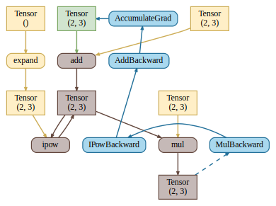

<h1 align="center">
  <br>
    kittygrad 
  <br>
</h1>

<h4 align="center">A small NumPy-based deep learning library with PyTorch-like API</h4>

<p align="center">
    
    
</p>

<p align="center">
  <a href="#description">Description</a> •
  <a href="#features">Features</a> •
  <a href="#installation">Installation</a> •
  <a href="#examples">Examples</a> •
  <a href="#details">Details</a> •
  <a href="#license">License</a>
</p>

## Description

kittygrad is a pet project that offers a familiar toolkit for training neural networks, written entirely in Python using [NumPy](https://numpy.org/). The project has the goal of building a minimal foundation for implementing basic popular deep learning techniques. Potentially, for those passing by, kittygrad could be useful for understanding some of the details in this area of machine learning. The concept of dynamic computational graph on tensors is taken as a basis. For simplicity the API is maximally close to [PyTorch](https://pytorch.org/).

## Features

At the moment the project is not finished and offers the following functionality:

-  Autograd engine (with 25+ operations)
-  Computational graph visualization 
-  Custom functions support
-  `no_grad` decorator and context-manager

## Installation

At the moment, the best way to install kittygrad is through this repository.

```bash
git clone https://github.com/tejpaper/kittygrad.git
cd kittygrad
pip install -r requirements.txt
```

### Running tests

Unit tests are run through [pytest](https://docs.pytest.org/en). To check the correctness of gradients, an element-wise comparison with tolerance to the results of the same operations in PyTorch is used (see ```Comparison``` class in ```test/conftest.py```).

As a consequence, these packages must be installed before running the tests:

```bash
pip install -r requirements/test.txt
```

Then simply:

```bash
pytest -s
```

## Examples

For a large number of examples, see the `examples` folder.

### Gradients

```python
import kittygrad as kitty

a = kitty.tensor([1, 2, 3], requires_grad=True)
b = a.std()
b.retain_grad()
c = b * kitty.dot(a, a)
print(c)  # tensor(14., grad_fn=<MulBackward>)

c.backward()
print(a.grad)  # tensor([-5.,  4., 13.])
print(b.grad)  # tensor(14.)
```

### Computational graph

```python
import kittygrad as kitty

a, b = kitty.randn(2, 2, 3)
a.requires_grad = True

with kitty.CompGraph() as dot:
    c = a + 42
    c **= 2
    _ = c * b
dot.view(cleanup=True)  # or just dot in case of jupyter cell
```


The round shape of the node denotes an operation on tensors or gradient flow, the rectangular shape denotes the tensors themselves. Colors have the following interpretation:

- **yellow** means no relation to auto-differentiation,
- **green** color denotes tensors whose gradients we are interested in,
- **brown** denotes the part of forward computations for which the backward graph is created,
- all backward nodes are marked in **blue**.

Inspired from [this](https://www.youtube.com/watch?v=MswxJw-8PvE) YouTube video.

## License

MIT